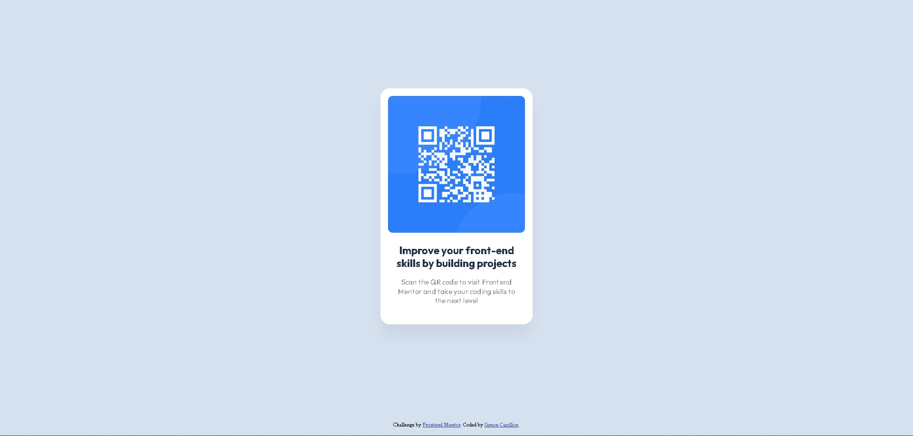

# Frontend Mentor - QR code component solution

This is a solution to the [QR code component challenge on Frontend Mentor](https://www.frontendmentor.io/challenges/qr-code-component-iux_sIO_H). Frontend Mentor challenges help you improve your coding skills by building realistic projects. 

## Table of contents

- [Overview](#overview)
  - [Screenshot](#screenshot)
  - [Links](#links)
- [My process](#my-process)
  - [Built with](#built-with)
  - [What I learned](#what-i-learned)
  - [Continued development](#continued-development)
  - [Useful resources](#useful-resources)
- [Author](#author)

## Overview

### Screenshot



### Links

- Live Site URL: https://qr-code-frontend-mentor-swart.vercel.app/

## My process

### Built with

- Semantic HTML5 markup
- CSS custom properties
- Flexbox

### What I learned

Nesting is cool !

```css
.card {
  display: flex;
  flex-direction: column;
  align-items: center;
  background-color: var(--color-white);
  width: 320px;
  height: 497px;
  box-shadow: 0px 25px 25px 0px rgba(0, 0, 0, 0.0477);
  border-radius: 20px;
  & img {
    width: 288px;
    height: 288px;
    border-radius: 10px;
    margin: 16px 16px 24px 16px;
  }
  & .text {
    width: 288px;
    height: 129px;
    margin: 0px 16px 40px 16px;
  }
}
```

### Continued development

I want to continue focusing and learning on the new features of CSS (2023) in future projects and then try Tailwind CSS.

### Useful resources

- [Box Shadow Generator](https://html-css-js.com/css/generator/box-shadow/) - This helped me to easily create the bow shadow of the card.
- [CSS custom properties (variables)](https://developer.mozilla.org/en-US/docs/Web/CSS/Using_CSS_custom_properties) - I really love this CSS feature, it didn't exist when I learned css. Useful !
- [CSS Reset](https://meyerweb.com/eric/tools/css/reset/) - For a better CSS start.
- [Using CSS Nesting](https://developer.mozilla.org/en-US/docs/Web/CSS/CSS_nesting/Using_CSS_nesting) - New feature I didn't know about, very useful too.

## Author

- Website - [Simon Capillon](https://simoncapillon.com/)
- Frontend Mentor - [@simon7195](https://www.frontendmentor.io/profile/simon7195)
